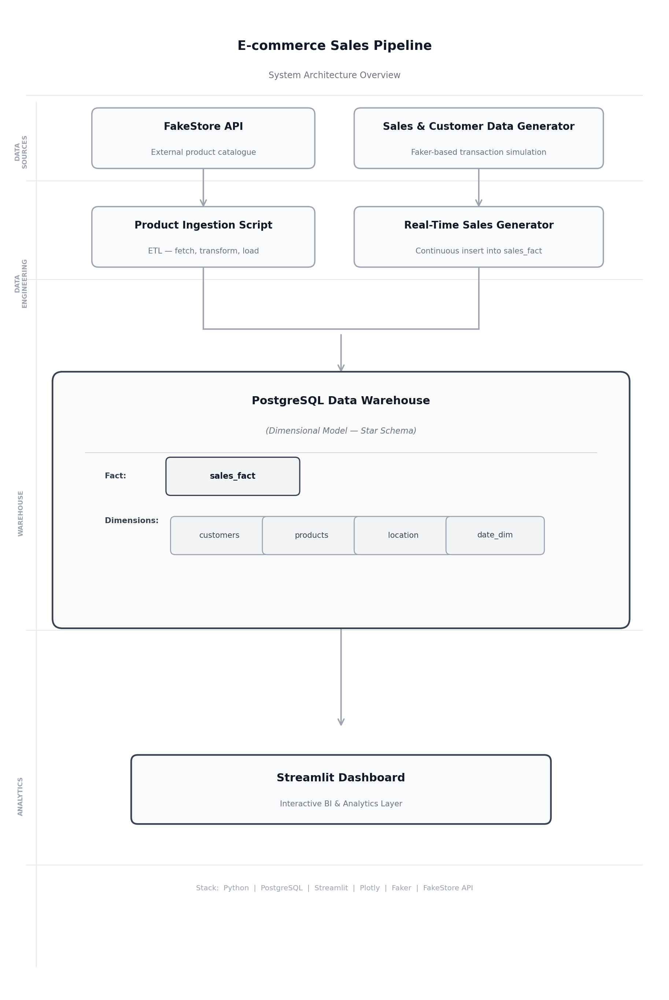
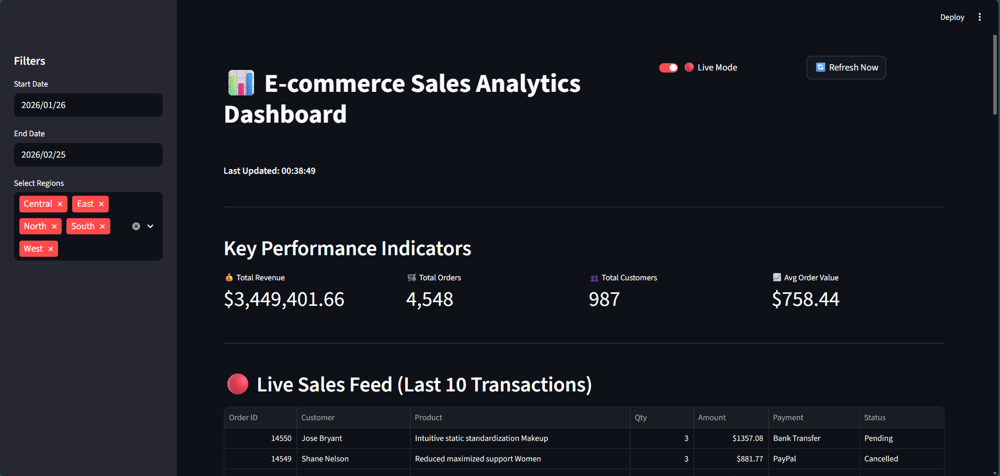
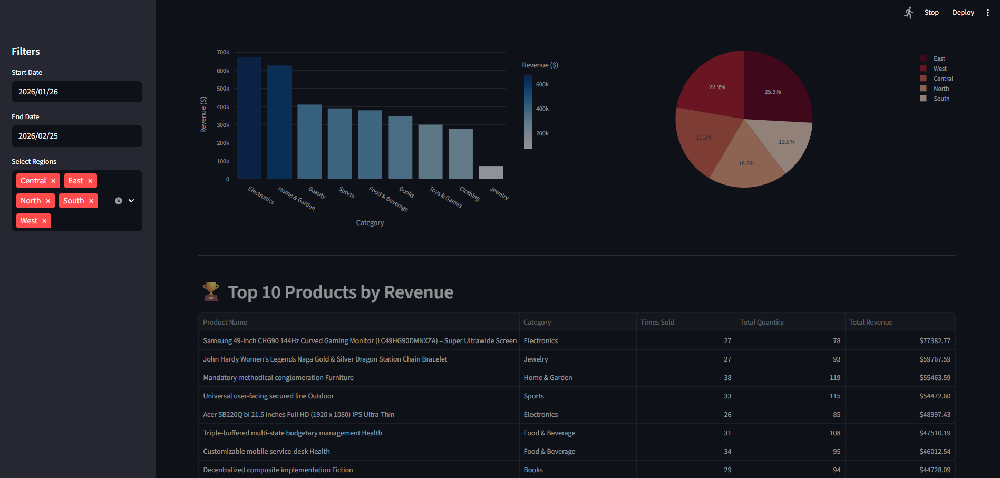
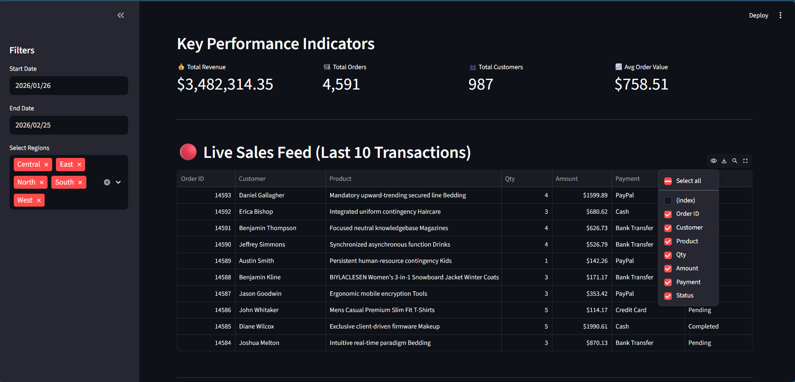

# 🚀 Real-Time E-commerce Data Platform

## 📌 Overview

This project simulates a real-time retail analytics system built using a dimensional data warehouse architecture.

It ingests product data from an external API, generates synthetic customer and sales transactions, and loads them into a PostgreSQL warehouse using a star schema model. A Streamlit-based BI dashboard provides near real-time KPI monitoring and business insights.

The goal of this project is to demonstrate practical Data Engineering and Analytics concepts including ETL design, dimensional modeling, real-time data simulation, and interactive reporting.

---

## 🏗 Architecture



High-Level Flow:

- FakeStore API → Product Ingestion Script (ETL)
- Sales & Customer Data Generator → Real-Time Sales Generator
- PostgreSQL Data Warehouse (Dimensional Model – Star Schema)
- Streamlit Dashboard (Analytics Layer)

---

## 📊 Dashboard Preview

### 🔹 Main Dashboard View



### 🔹 Charts & Product Insights



### 🔹 Filtered View Example



---

## 🗄 Data Model (Star Schema)

**Fact Table**

- `sales_fact`

**Dimension Tables**

- `customers`
- `products`
- `location`
- `date_dim`

This structure enables efficient aggregation and analytical queries for KPI reporting.

---

## ⚙️ Features

- Real-time sales transaction simulation
- API-based product ingestion
- Star schema warehouse design
- KPI monitoring (Revenue, Orders, Customers, AOV)
- Revenue trend analysis
- Category and region performance analysis
- Customer segment analysis
- Configurable live monitoring mode
- Environment-based configuration using `.env`

---

## 🛠 Tech Stack

- Python
- PostgreSQL
- Streamlit
- Plotly
- Faker
- REST API (FakeStore API)
- python-dotenv

---

## ▶️ How To Run

1. Clone the repository
2. Create a virtual environment
3. Install dependencies:

```
pip install -r requirements.txt
```

4. Create a `.env` file:

```
DB_HOST=localhost
DB_NAME=ecommerce_sales
DB_USER=postgres
DB_PASSWORD=your_password
```

5. Start real-time generator:

```
python realtime_sales_generator.py
```

6. Start dashboard:

```
streamlit run dashboard.py
```

---

## 🌐 Live Demo

🔗 Live Dashboard: **(Add Live Link Here)**

---

## 🚀 Future Improvements

- Add workflow orchestration (Airflow)
- Implement transformation/aggregation layer
- Add data validation & quality checks
- Dockerize services
- Deploy to cloud (AWS/GCP/Azure)

---

### 👤 Author

Built as a Data Engineering & Analytics portfolio project.
